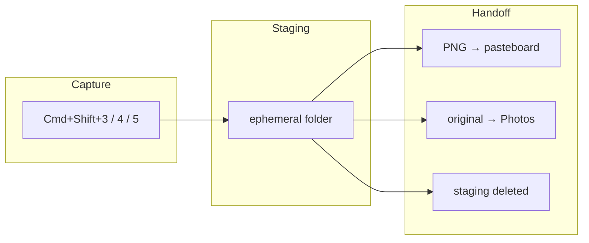
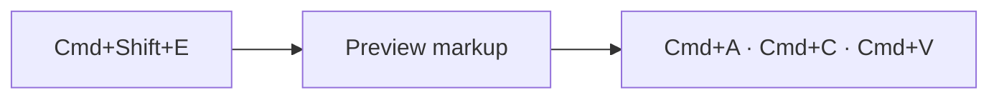
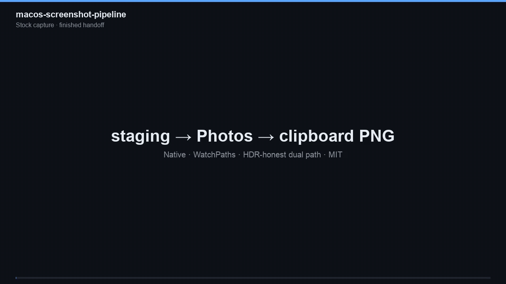
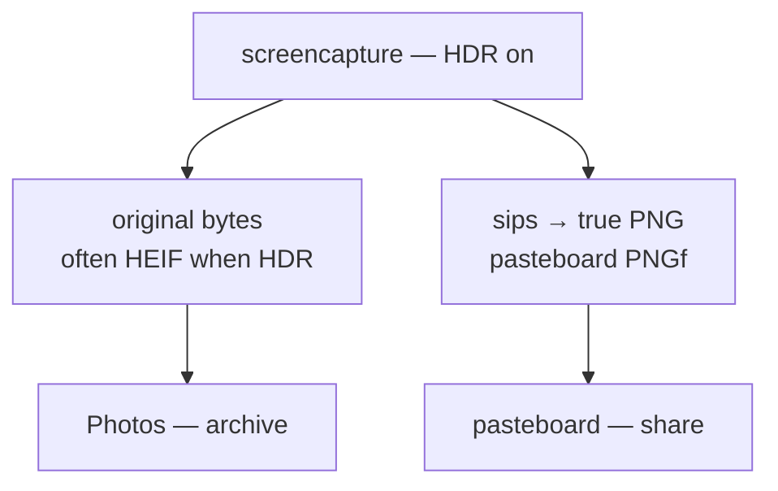

<div align="center">

# macos-screenshot-pipeline

### Stock macOS capture. Finished handoff.

**PNG on the clipboard. Originals in Photos. Markup in Preview.**  
No paid app. No Electron. No telemetry. No Desktop landfill.

```text
  Cmd+Shift+4   →   clipboard PNG  +  Photos  +  clean desk
  Cmd+Shift+E   →   Preview markup  →  paste anywhere
```

[](LICENSE)
[](#requirements)
[](#how-it-works)
[](#design-honesty)

</div>





<div align="center">

<!--
  Drop a 20–30s demo here when recorded:
  

  Suggested shot list:
  1. Desktop clean → Cmd+Shift+4 region
  2. Cmd+V into Notes / Discord
  3. Photos Recents with new item
  4. Cmd+Shift+E → circle something → copy → paste
-->

**Demo GIF** — *coming soon* (capture → paste → Photos → markup).

<sub>MIT · Travis J. Neuman · v0.1.0</sub>

</div>

---

## Why this exists

Apple’s Screenshot app still forces tradeoffs:

| You want | Stock macOS | **This** |
|:---------|:------------|:---------|
| **HDR** archive on XDR | HEIC when HDR is on | Photos keeps **original bytes** |
| **Paste** into Discord / browsers / chat | Separate shortcut *or* file | **Automatic real PNG** every time |
| **Photos / iCloud** library | Manual import | **Automatic** + caption |
| **Clean Desktop** | Default dumping ground | Ephemeral **staging** only |
| **Fast markup** | Thumbnail bubble or scavenger hunt | **`⌘⇧E`** → Preview |
| **Idle CPU** | — | Capture agent **exits**; no poll loop |

Paid suites solve adjacent problems. This is the **thin native layer** on top of shortcuts you already use.

---

## Design honesty

> One file is **not** “full HDR screenshot” **and** “universal lossless PNG.”  
> Anyone who says otherwise is selling something or confused.

| Path | What you get | Why |
|:-----|:-------------|:----|
| **Archive** → Photos | System original (often **HEIC/HEIF** when HDR is on; name may still end in `.png`) | Best practical dynamic range in Apple’s stack |
| **Share** → clipboard | **True PNG** via `sips` | Discord, Chromium, non-Apple apps |

Clipboard PNG is typically an **SDR tone-map** of HDR content. That is the correct tradeoff for “paste cleanly everywhere.”

`defaults write com.apple.screencapture type png` is a **preference**, not a guarantee under HDR.



---

## Install

**About two minutes** if Xcode CLT is already present.

```bash
git clone https://github.com/travisjneuman/macos-screenshot-pipeline.git
cd macos-screenshot-pipeline
./install.sh
```

### First-run checklist

| # | Action |
|:-:|:-------|
| 1 | **System Settings → Privacy & Security → Accessibility** → enable **Screenshot Pipeline Hotkey** |
| 2 | Optional deep link: `open "x-apple.systempreferences:com.apple.preference.security?Privacy_Accessibility"` |
| 3 | **⌘⇧4** → **⌘V** (Notes is a good first target) |
| 4 | Allow **Photos** automation if macOS prompts |
| 5 | **⌘⇧E** → markup → **⌘A** **⌘C** → **⌘V** |

### Installer flags

```bash
./install.sh --help
./install.sh --no-hotkey                 # capture path only
./install.sh --no-photos                 # clipboard only; keeps staging by default
./install.sh --keep-staging              # never delete staging after success
./install.sh --staging ~/Pictures/Screenshots
./install.sh --caption "Screen shot"
./install.sh --skip-prefs                # scripts/agents only
```

Config lands at:

```text
~/.config/macos-screenshot-pipeline/config.env
```

### Uninstall

```bash
./uninstall.sh                              # stop agents
./uninstall.sh --restore-stock-screenshots  # Desktop + thumbnail back
./uninstall.sh --purge                      # remove scripts/config/apps
```

Photos library content is **never** deleted.

---

## How it works

| Step | Mechanism |
|:----:|:----------|
| 1 | Installer sets capture **location** → staging (default `~/Pictures/Camera Roll`), **HDR on**, **floating thumbnail off** (immediate file write) |
| 2 | `launchd` **WatchPaths** fires only when staging changes — **no polling daemon** |
| 3 | `process.sh` waits for stable size → **PNG → clipboard** → **original → Photos** → delete staging on success |
| 4 | Tiny **Carbon** accessory app registers **⌘⇧E** → opens clipboard image in **Preview** |

Deep dive: **[docs/ARCHITECTURE.md](docs/ARCHITECTURE.md)**

---

## Requirements

| Need | Notes |
|:-----|:------|
| macOS + GUI session | LaunchAgents + TCC dialogs |
| **Photos** + **Preview** | Photos optional with `--no-photos` |
| **Xcode CLT** (`swiftc`) | Hotkey build — or `--no-hotkey` |
| **Accessibility** | Global ⌘⇧E |
| **Automation → Photos** | Import + caption |

**Full Disk Access is not required.** No network calls from this project.

---

## Permissions

| Permission | Why |
|:-----------|:----|
| Automation → Photos | Import + caption / keyword |
| Accessibility → Screenshot Pipeline Hotkey | Global hotkey + optional markup toolbar |

---

## Compare

| | **This** | CleanShot X | Shottr | `defaults` one-liners |
|:--|:---------|:------------|:-------|:---------------------|
| Cost | **Free (MIT)** | Paid | Freemium | Free |
| Photos-native archive | **Yes** | Different model | No | No |
| HDR story | **Documented dual-path** | Productized | Markup-first | Format only |
| Dependencies | macOS + CLT | App | App | None |
| Markup | Preview | Built-in | Built-in | Manual |
| Idle model | WatchPaths | App-dependent | App-dependent | N/A |

---

## Docs

| Doc | What’s inside |
|:----|:--------------|
| [USER-GUIDE](docs/USER-GUIDE.md) | Daily loops, disable/reenable |
| [ARCHITECTURE](docs/ARCHITECTURE.md) | Data flow, dual-path, resources, TCC |
| [INSTALL](docs/INSTALL.md) | Flags, layout, legacy migration |
| [OPERATIONS](docs/OPERATIONS.md) | Health checks, logs, restart |
| [TROUBLESHOOTING](docs/TROUBLESHOOTING.md) | Symptom → fix |
| [REFERENCE](docs/REFERENCE.md) | Paths, labels, env, log lines |
| [TEST-MATRIX](docs/TEST-MATRIX.md) | Manual acceptance checklist |
| [SECURITY](SECURITY.md) | Threat model / reporting |
| [GitHub About copy](docs/GITHUB-ABOUT.md) | Description, topics, social blurb |

```bash
./scripts/smoke-test.sh    # static checks + optional swiftc
```

---

## FAQ

<details>
<summary><strong>Does ⌘⌃⇧4 (clipboard-only) use this pipeline?</strong></summary>

No. That shortcut never writes a staging file. Use **⌘⇧3 / ⌘⇧4 / ⌘⇧5** for clipboard **and** Photos.

</details>

<details>
<summary><strong>Why is staging empty after a shot?</strong></summary>

Default success path deletes the file after Photos import. Check **Photos → Recents** and `~/Library/Logs/macos-screenshot-pipeline.log`.

</details>

<details>
<summary><strong>Finder shows HEIC / a weird preview — is it broken?</strong></summary>

Usually **HDR archive**. Expected. Pasteboard is still a real PNG.

</details>

<details>
<summary><strong>Can I remap ⌘⇧E?</strong></summary>

Not in v0.1 (fixed in the Swift agent). Follow-up territory.

</details>

<details>
<summary><strong>Google Photos doesn’t show my caption?</strong></summary>

Caption is set in Apple Photos (`description` / IPTC). Google’s mapping is best-effort and outside this tool.

</details>

<details>
<summary><strong>Will this fight another screenshot tool?</strong></summary>

If something else also watches the same staging folder or steals **⌘⇧E**, pick one owner. Installer unloads known legacy labels from the private precursor setup.

</details>

---

## Project principles

```text
✓  Native tools only     launchd · sips · osascript · Photos · Preview
✓  Idle-free capture     WatchPaths; process starts, works, exits
✓  Fail safe             Photos fail → staging retained
✓  Honest formats        HDR archive ≠ PNG paste — documented
✓  No telemetry          No network from this codebase
✓  Removable             uninstall agents; optional stock prefs restore
```

---

## License

[MIT](LICENSE) © [Travis J. Neuman](https://github.com/travisjneuman)

**v0.1.0** — production-proven behavior, public packaging. Issues and PRs welcome.

---

<div align="center">

```text
⌘⇧4 then paste.  ⌘⇧E to mark up.
```

<sub>Name is utilitarian on purpose. The workflow shouldn’t be.</sub>

</div>
